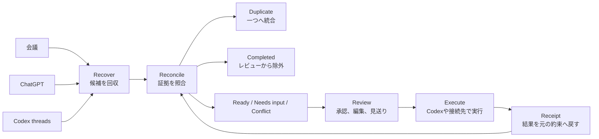

# Open Loop Inbox

> 人とAIとの会話に散らばった「やり残し」を、今判断できる少数のActionへ。

**AIエージェントに仕事を頼むほど、その仕事を覚えておくのは人間になる。**

Open Loop Inboxは、Codexの複数スレッドに残った依頼やネクストアクションを回収し、後続の会話と実行結果まで照合するInboxです。
同じ依頼は一つにまとめ、すでに終わった作業は除外し、条件が足りない作業は一問だけ確認します。

これは、ToDoを増やすAIではありません。 **判断する件数を減らし、残った仕事をその場で終わらせるAI**です。

残るのは、ユーザーがいま判断すべきActionだけです。

## 30秒でわかる価値

1.  **複数のセッションを横断して抽出する**
    - セッションごとに散らばったActionを集め、重複は一つにまとめます。
2.  **抽出したActionをその場で実行できる**
    - AIが実行条件を事前に判別し、条件が揃ったActionは承認後すぐに実行します。 判断が必要なActionは候補を先に提示し、候補にない指示もその場で追加できます。

## なぜ、普通のエージェントだけでは足りないのか

既存のAIエージェントは、明示された一つの依頼を計画し、実行することに長けています。 コードを書いてほしい、競合を調べてほしい、メールの下書きを作ってほしい、と頼めば、現在の会話を起点に仕事を進めます。

ただし、依頼そのものが別々の会話へ散らばっていると、ユーザーが先に「何を頼み直すべきか」を見つけなければなりません。 あるスレッドで始まった作業が別のスレッドで完了したことも、会議の約束に後から条件が加わったことも、通常はユーザーがつなぎ直します。

Open Loop Inboxは、このエージェントの手前にある見落としと、実行後に残る状態更新を扱います。

| 比較軸 | 一般的なAIエージェント | Open Loop Inbox |
| --- | --- | --- |
| 仕事の入口 | ユーザーが現在の依頼を与える | 過去の会話と実行証拠から残件を回収する |
| 基本単位 | 一つの依頼、一つのスレッド | 複数ソースにまたがる一つのAction |
| 得意なこと | 与えられた仕事を計画して実行する | 何がまだ残っているかを照合してから実行へ渡す |
| 完了の扱い | 現在の実行結果を報告する | 元の約束と結果を結び、残条件まで更新する |
| 人間の役割 | 頼む仕事を思い出し、文脈を渡す | 根拠と影響を見て、少数のActionを承認する |

Open Loop Inboxは既存エージェントを置き換えません。 散らばった仕事から実行すべきActionを組み立て、承認後の実行をCodexや接続先へ渡す制御層です。

エージェントが「頼まれた仕事を進める」なら、Open Loop Inboxは「頼みっぱなしの仕事を見つけ、どこまで終わったか確かめ、残りだけを進める」と言えます。

## ToDo管理やToDo仕分けとの違い

ToDoアプリは、登録されたタスクを保存し、期限、担当、優先度、進捗を管理します。 登録済みの仕事をチームで運用するなら、TodoistやAsanaのようなTask managerが適しています。

しかし、会話で生まれたすべての約束が、正しい粒度と最新条件でToDoへ登録されるとは限りません。 登録されなかった依頼は見えず、重複して登録された依頼は二件に見え、別の場所で完了した仕事は手動でDoneにするまで残ります。

単純なToDo抽出は、この問題を半分だけ解きます。 拾い漏れは減りますが、候補が増えるほど、重複、誤検出、完了済みの仕分けが新しい仕事になります。

| 比較軸 | ToDo管理 | AIによるToDo抽出と仕分け | Open Loop Inbox |
| --- | --- | --- | --- |
| 開始地点 | 登録済みのタスク | 一つの会話や文書 | 複数の会話と実行履歴 |
| 主な処理 | 保存、並べ替え、期限管理 | 候補の抽出、分類 | 回収、重複統合、完了除外、条件更新、実行 |
| 状態の更新 | 人間がDoneへ変更する | 抽出後は人間が管理することが多い | 後続会話、実行結果、Receiptを証拠に再判定する |
| 不足情報 | タスク登録者が補う | 不完全な候補として残りやすい | 実行に必要な一項目だけを確認する |
| 成功の尺度 | タスクが整理されている | 候補を多く見つける | 少ないレビューでOpen Loopが閉じる |

違いはカードの見た目ではありません。 ToDo管理が「確定した仕事の台帳」なら、Open Loop Inboxは**台帳へ入る前の約束と、Doneになった後の証拠をつなぐ照合層**です。

## 仕組み

会話から動詞らしい文を抜き出すだけでは、信頼できるInboxになりません。 Open Loop Inboxは、回収から完了までを一つの流れとして扱います。



### Recover

対象にしたCodexスレッドと、ユーザーが明示的に取り込んだ会議文字起こしや外部会話から、依頼、約束、調査、返信、日程調整、コード変更の候補を見つけます。

願望、仮定、雑談、他人に割り当てられた仕事、成果物を特定できない発言は、原則としてメインキューへ入れません。 再現率より適合率を優先し、曖昧な候補を大量に並べない設計です。

### Reconcile

同じ話題であることだけを理由に統合せず、成果物、対象、Owner、期間が両立するときだけDuplicateとしてまとめます。 後の会話が依頼を具体化していれば、新しい条件を採用しながら、古いEvidenceも保持します。

完了判定では、発言より実行証拠を強く扱います。 成功したReceipt、ファイル変更とテスト成功、ユーザーの完了宣言、エージェントの完了報告、依頼や計画、時間経過という順でEvidenceを評価します。 会話が止まったことや時間が過ぎたことだけでCompletedにはしません。

### Review

照合後に残ったActionには、判断に必要な情報を一枚へ集めます。

-   何を実行するか
-   誰のActionか
-   Executorと実行先
-   実行後に作られる成果物
-   外部への影響と取り消し可能性
-   最も強いEvidence
-   統合、除外、表示の理由
-   RiskとConfidence
-   実行に必要な不足情報一件

元の発言とAIが作った要約を分けて表示するため、ユーザーは推測を事実として承認せずに済みます。

### Execute

Actionは承認後にだけ実行します。 調査やリポジトリ内のCodex作業を進め、メールは下書き、カレンダーは自分用の仮予定までに制限します。

承認後に宛先、日時、対象Repositoryなどの重要条件が変わった場合は、そのまま実行せず再承認を求めます。 ユーザーのIntentと実際の操作を一致させるためです。

### Close

判断と実行の結果はReceiptへ記録します。 成功、失敗、見送り、取り消し可能性を元のActionへ結び付けることで、「何かを実行した」と「元の約束が満たされた」を分けて扱えます。

たとえば、コード変更が完了していても「結果を相手へ共有する」が残っていれば、そのCommitmentは部分完了です。 Open Loop Inboxは、終わった部分を消し、共有だけを次のActionとして残せます。

## 中心となるデータモデル

会話、ToDo、実行ログをそのまま一つのリストへ混ぜると、何を基準に状態を更新したのか分からなくなります。 そこで、役割の異なる五つの概念を分けています。

-   **Open Loop**：会話で生まれ、完了がまだ確認できない約束や作業
-   **Candidate**：一つの発言または実行記録から検出した候補
-   **Evidence**：依頼、条件変更、実行、テスト、承認を示す出典付きの証拠
-   **Action**：複数のCandidateとEvidenceを照合して作った、承認可能な実行単位
-   **Receipt**：判断内容、実行結果、影響、取り消し可能性を記録した証拠

Candidateを直接ToDoとして表示しないことが、レビュー件数を減らせる理由です。 Evidenceを介して複数のCandidateを一つのActionへまとめ、強い完了証拠があればAction自体を表示しません。

## なぜCodexなのか

Codexは、このプロダクトを実装するために使っただけではありません。 Open Loop Inboxの実行環境そのものです。

| Codexの役割 | Open Loop Inboxでの責務 |
| --- | --- |
| Source | 保存済みスレッドから依頼、変更、完了のEvidenceを得る |
| Reconciler | 複数ソースの重複、更新、完了、矛盾を判定する |
| Planner | 会話を実行可能なActionへ変え、不足情報を一項目へ絞る |
| Executor | 調査、コード修正、テスト、ファイル更新を実行する |
| Permission broker | 環境変更や外部書込みの前に承認を要求する |
| Auditor | Evidence、判断、実行結果をReceiptへ残す |

とくに開発作業では、同じCodex履歴の中に依頼と実行結果があります。 外部のタスク管理サービスが「実装は終わったらしい」と推測するのではなく、ファイル変更、コマンド実行、テスト成功を完了Evidenceとして扱える点がCodexとの強い接点です。

## 利用シーン

### 一日の終わり

複数のCodexスレッドと取り込んだ会話を読み返さず、その日に残ったActionだけを確認します。 三枚のカードを承認、編集、見送りすれば、その日のOpen Loopを短時間で整理できます。

### 週次レビューの前

一週間分の候補から重複と完了済みを除き、まだ判断が必要なActionを確定します。 優先順位を付ける前にリストの状態を正しくするため、古い仕事を再計画せずに済みます。

### 会議の後にCodexで実装したとき

会議ログには「機能を追加する」と残り、後のCodexスレッドでは実装とテストが完了しています。 Open Loop Inboxは実装部分をCompletedとして除外し、レビューや共有が残っている場合だけ次のActionとして提示します。

## 向いているユーザー

-   一つのプロジェクトで複数のCodexスレッドを使う個人開発者
-   会議、ChatGPT、Codexを往復するファウンダー、PM、クリエイター
-   実装の完了と、会議で交わした約束の完了を分けて確認したい人
-   完全自律より、根拠を見た短い承認を重視する人

一方、仕事が一つのToDoアプリだけで完結し、登録と状態更新が無理なく続いている場合は、既存のTask managerのほうが簡潔です。 録音品質、議事録生成、チームの工数管理を主目的にする場合も、それぞれの専用サービスが適しています。

## 現在試せるもの

このRepositoryには、価値の中心を異なる環境で検証するための四つの実装があります。

### Judge Sandbox

認証も外部データも不要な公開デモ用UIです。 架空の5ソースと7候補を使い、重複統合、完了除外、追加確認、スワイプ判断、モック実行、Receipt、Undoまで体験できます。

Fallback分析は決定論的に動くため、外部モデルや接続サービスに障害があっても「7 Candidatesから3 To Review」を再現できます。

### Shared Action Core

Candidateのグループ化、Evidence強度、完了判定、Action Proposal生成を担当する共通ロジックです。 Judge Sandboxと自動テストは同じGolden Sampleを使用します。

### Codex Plugin

`plugins/open-loop-inbox`に、Open Loop検出Skill、照合ポリシー、Action contract、履歴取得Script、ローカルReceipt Storeがあります。 Sample mode、限定したCodex履歴を読むLive mode、ユーザーが指定した会話だけを読むImport modeを定義しています。

### Local CompanionとMCP Apps UI実験

Local Companionは、利用者のPC上でCodex App Serverと接続する限定読取Bridgeです。 loopbackだけにbindし、起動時に指定したWorkspace以外を対象にしません。

MCP Apps UI実験は、サンプルActionをCodexの右サイドバーへ表示します。 現段階ではサンプル表示を対象とし、実履歴の解析やAction実行は行いません。

## Local Companionを起動する

Codex CLIがインストールされ、Codexへログイン済みであることが前提です。

```bash
cd companion
npm start -- --workspace /absolute/path/to/project
```

ブラウザで`http://127.0.0.1:4317`を開きます。 サーバーは指定したWorkspaceの限定された履歴だけを読み、Codex App Serverを外部へ公開しません。

## 安全境界

履歴を横断できることと、何でも自動実行してよいことは別です。 Open Loop Inboxは、回収、判断、実行の各段階に境界を置きます。

-   Judge Sandboxは架空のデータだけを使用する
-   実行前にAction、実行先、外部への影響を表示する
-   ユーザーが承認した後にだけ実行する
-   原文にない宛先、日時、数量を推定して確定しない
-   メールは下書きまでとし、送信しない
-   カレンダーは自分用の仮予定までとし、外部招待を送らない
-   購入、支払い、契約、公開投稿、破壊的削除を実行しない
-   ChatGPTや会議の内容は、ユーザーが明示的に取り込んだ範囲だけを読む
-   Receiptには会話全文、秘密値、Tool出力全文を保存しない

「自律性を上げるほど便利になる」とは限りません。 未完了の候補をAIが提案し、影響を受ける操作は人間が承認し、結果を証拠として戻すことで、速さと誤実行の抑制を両立します。

## 現在の制約

-   Judge Sandboxは事前定義したFallback分析を使用する
-   Live履歴のAction抽出と照合はCodex Skillの推論で行い、Judge Sandboxの決定論的ロジックとはまだ自動同期していない
-   GmailとCalendarは外部サービスへ接続せず、Demo Executorで再現している
-   ChatGPT全履歴の無制限な自動取得は対象外である
-   Local Companionの履歴Bridgeは、Actionの自動抽出、照合、スワイプUIへまだ接続していない
-   長期的なReceipt永続化と、承認履歴による個人最適化は未実装である

この制約があるため、現在の成果は「すべての会話を自動で片付ける完成品」ではありません。 それでも、候補を抽出するだけのAIから、証拠を照合して判断件数を減らすAIへ進めることは、同梱デモとテストで確認できます。

## 成功をどう測るか

Open Loop Inboxが増やした候補数ではなく、少ないレビューで閉じられたOpen Loop数を測ります。

**North Star Metric：Resolved Open Loops per Review Minute**

補助指標は次のとおりです。

-   **Review Reduction Rate**：候補から重複と完了を除き、実レビュー件数を減らした割合
-   **Action Precision**：表示されたActionのうち、ユーザーが妥当と判断した割合
-   **Evidence Coverage**：確認可能なEvidenceが付いたActionの割合
-   **Median Decision Time**：カード表示から判断までの時間
-   **Execution Completion**：承認されたActionがReceiptまで到達した割合
-   **Critical False Execution**：承認内容と異なる対象や操作を実行した件数

デモの7候補から3レビューへの削減率は約57%です。 候補を一件も取りこぼさないことより、表示された三件を安心して判断できることを優先しています。

## Repository構成

```text
app/                         Judge Sandbox UI
lib/open-loop/               Shared Action CoreとGolden Sample
plugins/open-loop-inbox/     Codex Plugin、Skill、照合ポリシー
companion/                   ローカルCodex履歴Bridge
tests/                       照合、描画、Pluginの自動テスト
```

## 一文で言えば

既存のエージェントは、ユーザーが見つけて頼んだ仕事を進めます。 ToDo管理は、ユーザーが登録した仕事を整理します。

Open Loop Inboxは、まだ頼み直されていない仕事を会話から見つけ、後続の証拠で残りだけに減らし、承認されたActionを実行して元の約束まで閉じます。

## 試す

### Judge Sandbox

Node.js 22.13以上を用意して、リポジトリのルートで起動します。

```bash
npm install
npm run dev
```

ターミナルに表示されたURLをブラウザで開き、「サンプルの1日を試す」を選択します。

1. 右、左、上スワイプの短い練習を完了するか、スキップします。
2. `5 Sources / 7 Candidates / 2 Merged / 1 Completed / 3 To Review`を確認します。
3. Actionカードをスワイプするか、カード下のボタンで処理します。
4. 三件を処理し、Action Receiptを確認します。

スワイプできない環境では、ボタン、左右と上の矢印キー、Enterを利用できます。

### Codex Plugin

リポジトリのルートで、ローカルMarketplaceからPluginを追加します。

```bash
codex plugin add open-loop-inbox@open-loop-inbox-local
```

Codexを再起動して新しいタスクを作成し、次のように依頼します。

```text
Use $open-loop-inbox. open-loop-inbox-ui の show_open_loop_actions を呼び出して、MCP UI実験を表示して。
```

チャット内の「サイドバーで開く」を押すと、3件のサンプルActionを右サイドバーで操作できます。
MCP Apps UIに対応していないホストでは、同じActionがテキストで表示されます。

実履歴を確認する場合は、対象Workspaceを絶対パスで指定します。

```text
Use $open-loop-inbox. scan_open_loop_history で /absolute/path/to/workspace の最近のCodex履歴を読み、未完了Actionだけを表示して。
```

実履歴のscanは読取専用です。
Actionの実行とReceiptの保存には、別途明示承認が必要です。

本番ビルドと自動テストは、リポジトリのルートで次を実行して確認できます。

```bash
npm test
npm run lint
npx tsc --noEmit
```
