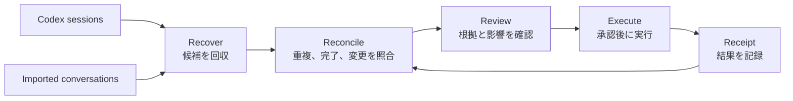

# Open Loop Inbox

> 人とAIとの会話に散らばった「やり残し」を、今判断できる少数のActionへ。

**AIエージェントに仕事を頼むほど、その仕事を覚えておくのは人間になる。**

Open Loop Inboxは、Codexの複数セッションに残った依頼やネクストアクションを回収し、後続の会話と実行結果まで照合するInboxです。
同じ依頼は一つにまとめ、すでに終わった作業は除外し、条件が足りない作業は一問だけ確認します。

これは、ToDoを増やすAIではありません。
**判断する件数を減らし、残った仕事をその場で終わらせるAI**です。

## 30秒でわかる価値

1. **複数のセッションを横断して抽出する**
   - セッションごとに散らばったActionを集め、重複は一つにまとめます。
   - 後続のセッションですでに完了していたActionは、レビュー対象から除外します。
2. **抽出したActionをその場で実行できる**
   - AIが実行条件を事前に判別し、条件が揃ったActionは承認後すぐに実行します。
   - 判断が必要なActionは候補を先に提示し、候補にない指示もその場で追加できます。

デモでは、5つの会話から見つかった7件の候補を、重複、完了済み、曖昧な候補の処理によって3件のレビューへ減らします。

```text
5 Sources → 7 Candidates → 2 Merged → 1 Completed → 3 To Review
```

## 既存のエージェントやToDo管理との違い

一般的なAIエージェントは、ユーザーから与えられた依頼を計画し、実行することに長けています。
ToDoアプリは、登録済みのタスクを保存し、期限、担当、優先度を管理します。

しかし、依頼そのものが複数の会話へ散らばっていると、ユーザーが先に「何を頼み直すべきか」を見つけなければなりません。
別のセッションで完了した作業や、後から変更された条件も、通常はユーザーがつなぎ直します。

Open Loop Inboxは、その見落としと状態更新を引き受けます。

| 比較軸 | 一般的なAIエージェント | ToDo管理とToDo抽出 | Open Loop Inbox |
|---|---|---|---|
| 仕事の入口 | ユーザーが現在の依頼を与える | 登録済みタスク、または一つの会話から始まる | 複数の会話と実行証拠から残件を回収する |
| 基本単位 | 一つの依頼、一つのセッション | 一件ずつのタスク候補 | 複数ソースにまたがる一つのAction |
| 主な処理 | 与えられた仕事を計画して実行する | 保存、抽出、分類、期限管理 | 重複統合、完了除外、条件更新、実行 |
| 完了の扱い | 現在の実行結果を報告する | 人間がDoneへ変更する | 元の依頼と実行結果を結び、残条件を更新する |
| 人間に残る作業 | 頼む仕事を思い出し、文脈を渡す | 重複や完了済みの候補を整理する | 根拠と影響を見て、少数のActionを承認する |

Open Loop Inboxは、既存のエージェントやTask managerを置き換えません。
散らばった仕事から実行すべきActionを組み立て、承認後の実行をCodexや接続先へ渡す照合層です。

確定済みタスクの進捗管理には既存のTask managerが適しています。
Open Loop Inboxが扱うのは、タスクとして登録される前の約束と、別の場所で実行された後の証拠です。

## 仕組み

会話から依頼らしい文を抜き出すだけでは、重複や完了済みの候補まで表示されます。
Open Loop Inboxは、回収から実行結果の記録までを一つの流れとして扱います。



1. **Recover**：対象にしたCodexセッションと、明示的に取り込んだ会話から未完了候補を回収します。
2. **Reconcile**：成果物と対象が同じ候補をまとめ、完了を示す後続の実行証拠がある候補を除外し、最新条件を採用します。
3. **Review**：Action、元の発言、実行先、外部への影響を一枚のカードへまとめます。
4. **Execute**：承認されたActionを実行し、結果をReceiptとして元の依頼へ結び付けます。

Receiptは単なる操作ログではありません。
次回の照合で、同じ仕事を未完了として再表示しないための証拠になります。

## なぜCodexなのか

Codexは、このプロダクトを実装するために使っただけではありません。
Open Loop Inboxの情報源であり、照合と実行を担う環境でもあります。

保存されたCodexセッションには、ユーザーの依頼だけでなく、ファイル変更、コマンド実行、テスト結果も残ります。
そのため、別のサービスから「実装は終わったらしい」と推測するのではなく、実際の作業結果を完了の証拠として扱えます。

まだ作業が残っていれば、同じCodex環境で調査、コード修正、テスト、ファイル更新まで続けられます。
発見、判断、実行を別々のサービスへ渡さず、一つの流れとして閉じられます。

Open Loop InboxはCodex Pluginとして動作し、MCP Apps UIを使ってActionカードをCodexの右サイドバーへ表示できます。
ユーザーはカードを見ながらActionを承認、見送り、追加指示できるため、チャットで一件ずつ指示を書き直す必要がありません。

履歴の読取、照合、UIでの判断、実行、Receiptの記録までをCodex内で完了できます。
別のTask managerや外部ダッシュボードを行き来する必要はありません。

## こんな人に向いている

- 一つのプロジェクトで複数のCodexセッションを使う個人開発者
- 会議、ChatGPT、Codexを往復するファウンダー、PM、クリエイター
- 一日の終わりに、会話を読み返さず残ったActionだけを確認したい人
- 週次計画の前に、重複と完了済みを除いた状態から優先順位を決めたい人
- 完全自律より、根拠を見た短い承認を重視する人

一方、仕事が一つのToDoアプリだけで完結し、登録と状態更新が無理なく続いている場合は、既存のTask managerのほうが簡潔です。
録音品質や議事録生成を主目的にする場合も、それぞれの専用サービスが適しています。

## デモを試す

Judge Sandboxは、認証も外部データも不要です。
架空の会話を使い、重複統合、完了済みの除外、追加確認、スワイプ判断、モック実行、Receipt、Undoまで体験できます。

デモサイトはCodex Sitesへ限定公開しています。
公開状態の詳細は[デモサイト公開状況](./docs/%E3%83%87%E3%83%A2%E3%82%B5%E3%82%A4%E3%83%88%E5%85%AC%E9%96%8B%E7%8A%B6%E6%B3%81.md)を参照してください。

1. 「サンプルの1日を試す」を選択します。
2. 右、左、上スワイプの短い練習を完了するか、スキップします。
3. `5 Sources / 7 Candidates / 2 Merged / 1 Completed / 3 To Review`を確認します。
4. Actionカードをスワイプするか、カード下のボタンを使います。
5. 3件を処理し、Action Receiptを確認します。

スワイプできない環境では、ボタン、左右と上の矢印キー、Enterを利用できます。
Reduced Motionとモバイル表示にも対応しています。

## 安全性と現在の対応範囲

履歴を横断できることと、何でも自動実行してよいことは別です。
Open Loop Inboxは、読取範囲と実行内容の両方に境界を置きます。

- Codex履歴は、指定したWorkspaceと件数上限の範囲だけを読みます。
- 会議やChatGPTの内容は、ユーザーが明示的に取り込んだものだけを扱います。
- Action、実行先、外部への影響を表示し、ユーザーの承認後にだけ実行します。
- メールは下書き、カレンダーは自分用の仮予定までとし、送信や外部招待は行いません。
- 購入、支払い、契約、公開投稿、破壊的削除は実行しません。
- Receiptには会話全文、秘密値、Tool出力全文を保存しません。

現在のJudge Sandboxは、架空のデータと決定論的なFallback分析を使用します。
GmailとCalendarも外部サービスへ接続せず、Demo Executorで再現しています。

Codex Pluginには、サンプルを試すSample mode、限定したCodex履歴を読むLive mode、指定した会話を読むImport modeがあります。
MCP Apps UIでは、サンプルActionと限定したLive Scanの結果をCodexの右サイドバーへ表示できます。
現段階のMCP Toolは読取専用であり、UIからのAction実行とReceipt保存はまだ接続していません。
Local CompanionはCodex履歴へ安全に接続できますが、Actionの自動抽出、照合、スワイプUIとはまだ接続していません。

## ローカルで起動する

Node.js 22.13以上を使用します。

```bash
npm install
npm run dev
```

ターミナルに表示されたURLをブラウザで開きます。

本番ビルドと自動テストは次のコマンドで確認できます。

```bash
npm test
npm run lint
npx tsc --noEmit
```

### Local Companion

Codex CLIがインストールされ、Codexへログイン済みであることが前提です。

```bash
cd companion
npm start -- --workspace /absolute/path/to/project
```

ブラウザで`http://127.0.0.1:4317`を開きます。
サーバーは指定したWorkspaceの限定された履歴だけを読み、Codex App Serverを外部へ公開しません。

## 関連文書

- [プロダクト要件](./docs/%E3%83%97%E3%83%AD%E3%83%80%E3%82%AF%E3%83%88%E8%A6%81%E4%BB%B6.md)
- [サイト要件](./docs/%E3%82%B5%E3%82%A4%E3%83%88%E8%A6%81%E4%BB%B6.md)
- [Plugin要件](./docs/%E3%83%97%E3%83%A9%E3%82%B0%E3%82%A4%E3%83%B3%E8%A6%81%E4%BB%B6.md)
- [実装フェーズ](./docs/%E5%AE%9F%E8%A3%85%E3%83%95%E3%82%A7%E3%83%BC%E3%82%BA.md)
- [Phase 1と2の実装レポート](./docs/Phase1-2%E5%AE%9F%E8%A3%85%E3%83%AC%E3%83%9D%E3%83%BC%E3%83%88.md)
